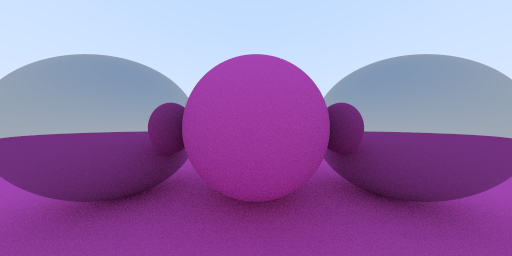
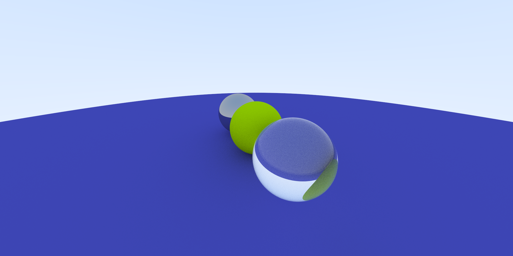

# miniray

This is a toy rudimentary path tracer, built while following along with Peter
Shirley's "Ray Tracing in One Weekend" book. It's the first book in a three
part series that can be read online [here](https://raytracing.github.io/)
(thanks to all who maintain the code and online versions!).

It's implemented in c99. The books are great and make a fun project so I may
end up doing this all over again in a different language. The repo is organized
accordingly.

## Current Status

The tracer currently supports everything covered in the first book. This means:

* Spherical geometry
* Ideal Lambertian materials - "Matte" objects the reflect light diffusely.
* Metal materials - Objects that reflect light like a mirror. There is also an
  optional `fuzz` factor that jitters reflected light, giving a rough
  appearance.
* Dielectrics - Objets that both reflect and refract. Refraction calculated in
  accordance with Snell's law, bendind light according to the ratio of the
  dielectric constants of the materials at the boundary. Schlick's
  approximation is used to decide if a ray should reflect, generating greater
  reflection at steaper viewing angles.
* A positionable and orientable camera.
* Depth-of-focus blur.

## Building and Running

Use the Makefile provided to build the tracer. A convenient CLI for the program
is not provided. The executable takes three arguments, the output scene width,
the output scene height, and the scene type. Only `gradient` and `spheres` are
supported. The makefile has targets for generating these scenes as well.

## TODO

* Multithreading
* Touch up the progress printer and put it under a verbose flag.
* Consider a simple camera/scene configuration file format and parser
* The next book!
